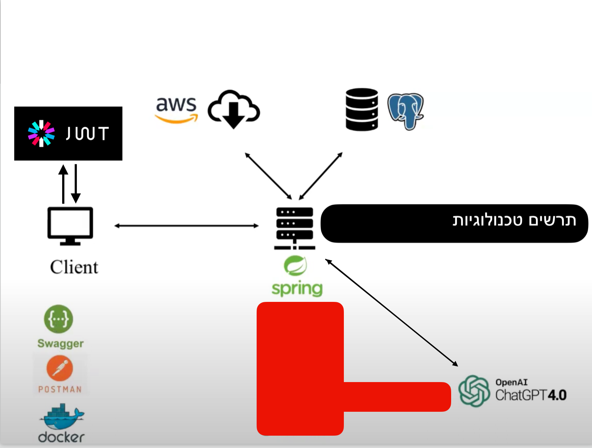
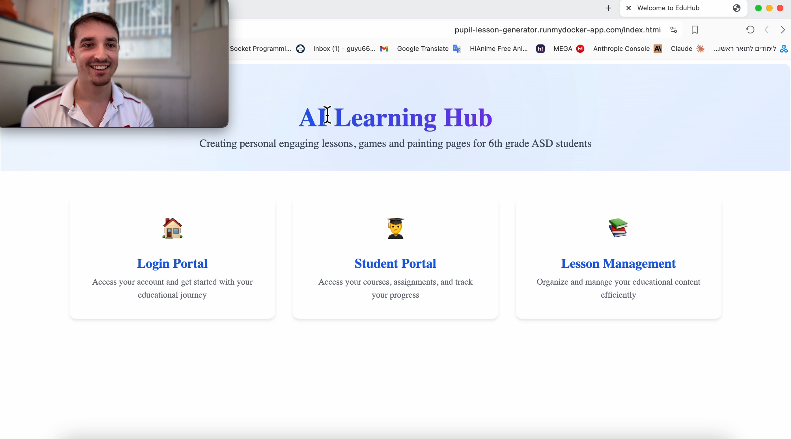

# AI Learning Hub

## Features

### AI Content Generation
- Personalized Lesson Plans: Automatically generates lessons based on student interests and learning profiles
- Interactive Games: Creates customized educational games inspired by familiar game formats
- Art Activities: Generates art prompts and activities tailored to individual student preferences
- Student-Centric Design: All content is dynamically adapted to match student attributes and engagement patterns

### Core Functionality
- Secure authentication system using JWT tokens
- Advanced filtering, searching, and sorting capabilities in the student portal
- Comprehensive lesson management system for educators
- Seamless image upload and management via AWS S3
- Intuitive content organization with PostgreSQL database

## Technology Stack
- Backend: Spring Boot (Java)
- Database: PostgreSQL
- Authentication: JWT
- Cloud Storage: AWS S3
- AI Integration: OpenAI GPT API
- Containerization: Docker
- Frontend: HTML, CSS, JavaScript (following best practices for accessibility)

## System Architecture


## Getting Started

### Prerequisites
- Java 11 or higher
- Docker
- PostgreSQL
- AWS Account (for S3 storage)
- OpenAI API key

### Installation
```bash
# Clone the repository:
git clone https://github.com/yourusername/ai-learning-hub.git
```
# Configure environment variables:
spring.datasource.url=jdbc:postgresql:=your_postgresql_url/database
SPRING_DATASOURCE_USERNAME=your_username
spring.datasource.password=your_password
spring.datasource.driver-class-name=org.postgresql.Driver
spring.jpa.show-sql = true
spring.jpa.hibernate.ddl-auto = update
spring.jpa.database-platform=org.hibernate.dialect.PostgreSQLDialect
amazon.aws.accesskey==your_aws_access_key
amazon.aws.secretkey==your_aws_secret_key
bucket.url=your_bucket_url
openai.api.key=your_openai_api_key

## Demo & Documentation

### Live Demo
Access the live application at: https://pupil-lesson-generator.runmydocker-app.com/  
(Please refresh the page if it doesn't load immediately)

### Project Overview Video
[](https://www.youtube.com/watch?v=1flCuz2F4eM)

Watch a comprehensive explanation of the project's features and implementation in this video overview. The demonstration covers:
- System architecture and technology choices
- AI content generation example
- Student profile management
- Real-time examples of generated content
- JWT authentication + JWT.io explain
- Docker + Dockerhub
- runmydocker deployment

## API Documentation

### Authentication Endpoints
- POST /user
- POST /authenticate

### Content Generation Endpoints
- GET /api/pupils/lessons
- GET /api/pupils/lessons/{pupilId}/{lessonId}/display
- POST /api/pupils/lessons/{pupilId}/lessons
- GET /api/pupils/lessons/status/${taskId}

### Pupil Management Endpoints
- GET /api/pupils
- POST /api/pupils
- GET /api/pupils/lessons/{pupilId}/{lessonId}/display
- PUT /api/pupils/{id}
- GET /api/pupils/{id}
- DELETE /api/pupils/{id}

## Contributing
Contributions are welcome! Please feel free to submit a Pull Request.

## Contact
- Project Link: https://github.com/GuyBernstein/Game-Image-LessonPlan-AIGeneration
- Public Site: https://pupil-lesson-generator.runmydocker-app.com/
